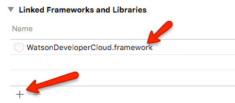

# Watson-iOS-SDK-Demo
This project contains a simple application that demonstrates how to setup & integrate the [IBM Watson iOS SDK (beta)][ios_sdk] into your iOS applications.

## Getting Started

The [IBM Watson iOS SDK (beta)][ios_sdk] helps simplify integration with many of the [Watson Developer Cloud][watson_developer_cloud] services, including the IBM Watson [Dialog][dialog], [Language Translation][translation], [Natural Language Classifier][nlc], [Personality Insights][p_insights], [Speech To Text][stt], [Text to Speech][tts], [Alchemy Language][alchemy], or [Alchemy Vision][alchemy] services – all of which are available today, and can now be integrated with just a few lines of code. 

### Setup the Services

In order to take advantage of the  [IBM Watson iOS SDK (beta)][ios_sdk], you must first setup [IBM Watson services on Bluemix][watson_bluemix] that the mobile SDK will leverage.

This sample app is leveraging the [IBM Watson Language Translation][language_translation] service

1. Head over to [IBM Bluemix][bluemix] and create a new application.  Choose the runtime for [Node.js][node] as your base. 
2. Next you need to add the [Watson Language Translation Service][translation] to the app you just created.  From the app dashboard, select "Add Service or API" and add the [Language Translation Service][translation] to your app.

### Get the SDK

Next you need to get download the [IBM Watson iOS SDK (beta)][ios_sdk].  You can either download it directly as a zip file, or you can clone the git repository to your local machine.  Follow [installation instructions][ios_sdk_install] to compile the SDK for use on your own machine.

### Setup the Client App

Now we need to pull the SDK into the app so we can start integrating Watson services.

1. Download or clone the contents of this repo to your local machine.  
2. Open the Translator.xcodeproj project file in Xcode.
3. Drag the WatsonDeveloperCloud.xcodeproj from the SDK you just downloaded into the Xcode project navigator (left side bar).   
4. You will be prompted to create a workspace.  Do it.
5. Compile the WatsonDeveloperCloud target
6. Update the "Translator" target and add a link to the WatsonDeveloperCloud.framework    
6. Next, Compile and run the Translator project to launch it in the iOS Simulator

## Integration of Watson Services

Integration of Watson services is as simple as creating an instance of the service class you want to use, then calling the methods that are exposed through the  [IBM Watson iOS SDK (beta)][ios_sdk].  

For example, the *entire* sample app code inside of ViewController.swift is less than 100 lines of code, and most of that is even whitespace.  

Integration of the [IBM Watson Language Translation][language_translation] service is shown below:

<pre><code>let translation = LanguageTranslation(username:"your username", password: "your password")

translation.translate([inputText!], source: "en", target: model.target!) { text, error in
    let translation = text![0]
    print(translation)
}
</code></pre>

Feel free to explore this project, and be sure to explore the [IBM Watson iOS SDK (beta)][ios_sdk].

[bluemix]: https://bluemix.net
[ios_sdk]: https://github.com/watson-developer-cloud/ios-sdk
[ios_sdk_install]:https://github.com/watson-developer-cloud/ios-sdk#installation
[watson_bluemix]: http://www.ibm.com/cloud-computing/bluemix/solutions/watson/
[language_translation]: https://console.ng.bluemix.net/catalog/services/language-translation/
[watson_developer_cloud]: https://www.ibm.com/smarterplanet/us/en/ibmwatson/developercloud/

[dialog]:https://console.ng.bluemix.net/catalog/services/dialog/
[translation]:https://console.ng.bluemix.net/catalog/services/language-translation/
[nlc]:https://console.ng.bluemix.net/catalog/services/natural-language-classifier/
[p_insights]:https://console.ng.bluemix.net/catalog/services/personality-insights/
[stt]:https://console.ng.bluemix.net/catalog/services/speech-to-text/ 
[tts]:https://console.ng.bluemix.net/catalog/services/text-to-speech/ 
[alchemy]:https://console.ng.bluemix.net/catalog/services/alchemyapi/
[node]:https://console.ng.bluemix.net/catalog/starters/sdk-for-nodejs/